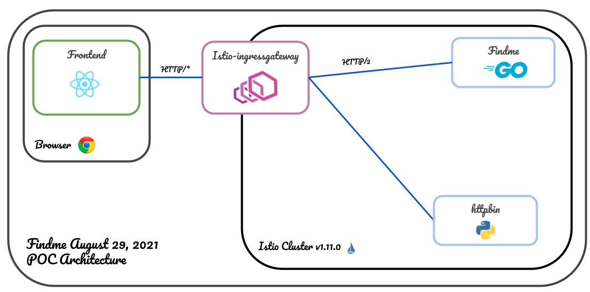

# Findme Operator POC
_During this lab, you will create a local cluster with minikube, install Istio, deploy the operator resources, and then deploy the application the application through CRDs._

[Google Slides Preso](https://docs.google.com/presentation/d/1qU_kT3EO20aDPwlDGaoStWTXPQHz-W3T5YUtqb2vdAU/edit#slide=id.g547716335e_0_2330)    

**Steps**
- [Architectural Overview](#architectural-overview)
- [Create Minikube Cluster](#minikube-environment)
- [Install Istio](#install-istio)
- [Deploy Operator Resources](#deploy-operator-resources)
- [Deploy Findme](#deploy-findme)
- [Create a LoadBalancer for Istio-ingressgateway service](#create-a-loadbalancer)
- [Interact with Applications](#interact-with-apps)
- [Cleanup](#cleanup)   

## Architectural Overview
Overview of the target endstate. We deploy the findme application and the httpbin application. The sole purpose of the httpbin application is for internal testing from within the cluster. The requests come in through the istio-ingress gateway and are routed accordingly via the configuration specified in the `default` virtual service.


## Minikube Environment
Create a single-node cluster using minikube.
```
minikube start --cpus=4 --memory=8192
```

## Install Istio
Install a slim version of istio to control cluster level routing. We will install the CRDs for Istio, the control plane, istiod, and then finally the istio-ingress gateway.
```
# Create istio-system namespace
kubectl create ns istio-system

# Label default namespace to allow sidecars
kubectl label ns default istio-injection=enabled

# Verify Label
kubectl get ns default -ojsonpath='{.metadata.labels.istio-injection}'  

# Install Istio base chart which contains cluster-wide resources use by the istio control plane
helm install istio-base helm-charts/istio -n istio-system

# Verify resource were applied to the cluster
kubectl get crd | grep istio.io

# Install Istio discovery chart which deploys `istiod` service
helm install istiod helm-charts/istiod -n istio-system

# Verify installation
kubectl get svc istiod -n istio-system

# Install Istio ingress gateway
helm install istio-ingress helm-charts/istio-ingress -n istio-system 

# Verify installation
kubectl get svc -n istio-system istio-ingressgateway
```

## Deploy Operator Resources
We will now install the resources necessary to support the Findme operator.
```
helm install findme helm-charts/findme 
```

## Deploy Findme
This is where we deploy the application from a custom resource definition
```
kubectl apply -f -<<EOF
apiVersion: application.caseywylie.io/v1alpha1
kind: Findme
metadata:
  name: findme-app
spec: 
  size: 1
EOF
```

## Create a loadbalancer
Istio ingress gateway needs a dedicated IP address, you can expose it as type `NodePort` or `LoadBalancer`, with the default being `LoadBalancer`. In order to a serve the `svc/istio-ingressgateway` as LoadBalancer we need utlize `minikube tunnel` on order to expose the service as a `LoadBalancer`. Run this command in a new terminal.

```
minikube tunnel
```

## Interact with Apps
While minikube tunnel is running in another terminal.   
Call the httpbin service from the terminal.   
```
curl http://localhost/get
```

Open Findme app in the browser
open `localhost` in your browser.
```
chromium localhost
```

## Cleanup
_This command will clean up the environment._
```
# Stop the terminal running `minikube tunnel`

# disabled sidecar injection
kubectl label namespace istio-system istio-injection=disabled --overwrite

# Uninstall Istiod
helm uninstall istiod helm-charts/istiod -n istio-system

# Uninstall Istio-Ingress
helm uninstall istio-ingress helm-charts/istio-ingress -n istio-system

# Uninstall Istio base
helm uninstall istio-base helm-charts/istio -n istio-system

# Uninstall Findme Operator
helm uninstall findme helm-charts/findme 

# Delete istio-system namespace
kubectl delete ns istio-system 

# Delete the minikube cluster
minikube delete
```